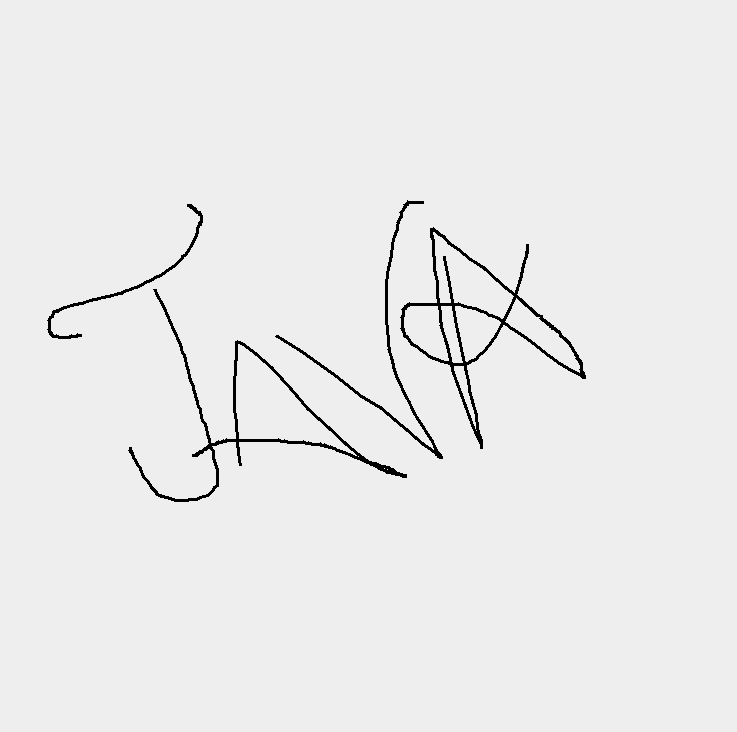

Collaborative Whiteboard 

A real-time collaborative whiteboard application built in Java using Swing and sockets — draw and sync changes across multiple clients!

Features
Real-time collaboration: Multiple users can draw simultaneously, and changes sync instantly.  
Color & brush selection: Choose any color or brush size live.  
Save as image: Export the board as a PNG snapshot.  
Simple, responsive UI built with Java Swing.

Screenshots

💻 How to Run

1. Start the server  
- Open `WhiteboardServer.java` in your IDE.
- Run it to start the server on port 5000.

2. Start one or more clients  
- Open `WhiteboardClient.java` in your IDE.
- Run it → enter server IP (use `127.0.0.1` if running locally) → set your username → start drawing!

3. Collaborate  
- Run multiple instances of the client on the same or different machines (connected on the same network).

🛠️ Tech Stack
- Java SE 8+
- Java Swing
- Java Sockets

License
MIT License — feel free to use, modify, and share!

Author
[Kritika Regmi](https://github.com/KritiikaaR)
